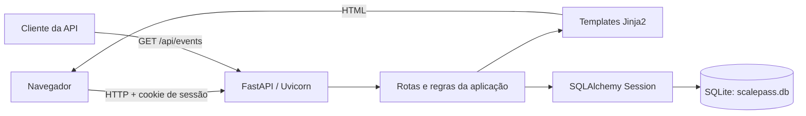
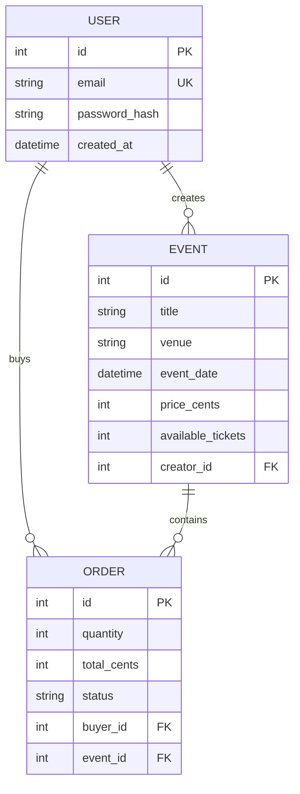
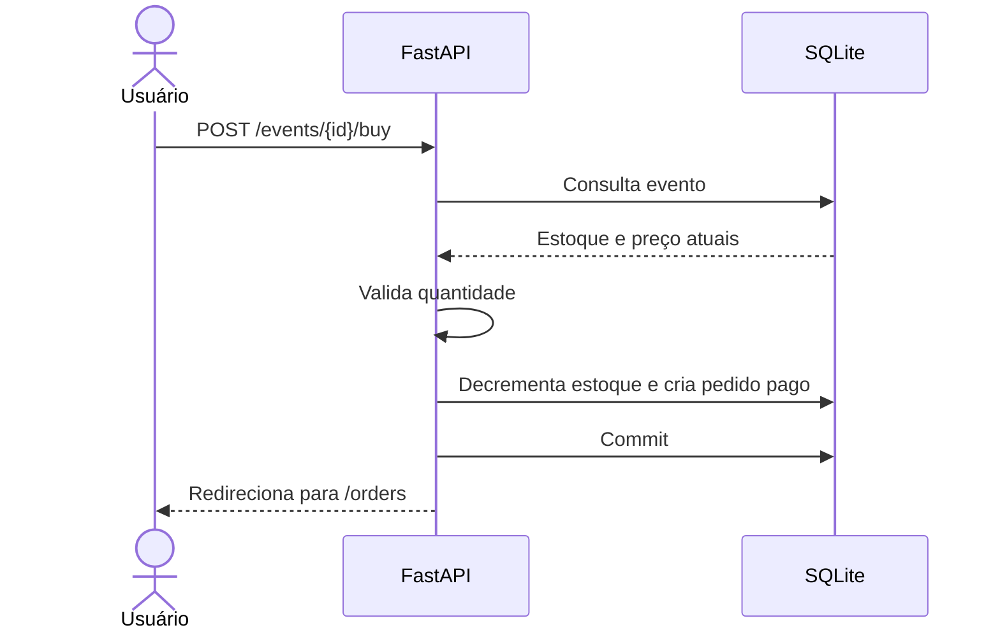

# Arquitetura atual

## Visão geral

ScalePass 0.1 é um monólito web executado em um único processo. A aplicação recebe
requisições HTTP, executa as regras diretamente nas funções de rota, acessa um
banco SQLite e renderiza HTML no servidor.



Não existem serviços externos, jobs em segundo plano ou componentes distribuídos.

## Componentes

### Entrada HTTP

`app/main.py` contém a instância FastAPI, as rotas de páginas, formulários e o
endpoint JSON. Uvicorn fornece o servidor ASGI.

As páginas são renderizadas com Jinja2. Não há frontend separado nem etapa de
build de JavaScript.

### Autenticação

`app/auth.py` autentica por e-mail e senha. Após o login, o identificador do usuário
fica em uma sessão assinada armazenada em cookie. O middleware de sessão é o único
middleware explícito da aplicação.

### Persistência

`app/database.py` cria um engine SQLAlchemy global e entrega uma `Session` por
requisição. `app/models.py` define três tabelas:



As tabelas são criadas no início da aplicação com `create_all()`. Ainda não há um
sistema de migrações.

### Compra

A compra ocorre inteiramente durante uma requisição:



Não há reserva temporária nem integração financeira. Uma compra aceita representa
imediatamente um pedido com estado `paid`.

## Decisões e limites atuais

- Execução em um único processo e um único nó.
- SQLite é adequado ao desenvolvimento local e a instalações pequenas.
- Todas as consultas e escritas acontecem de forma síncrona.
- Catálogo e histórico ainda não possuem paginação.
- Criação de esquema não mantém histórico de alterações.
- Não existem métricas, traces, logs estruturados ou health checks.
- Não existem cache, fila, workers ou processamento periódico.
- O endpoint JSON disponível é somente leitura.

Estes pontos descrevem o produto atual; não são compromissos de arquitetura para
versões posteriores.

## Fluxo de dependências

```text
main.py -> auth.py -> models.py -> database.py -> config.py
   |                       ^
   +-----------------------+
```

Templates conhecem apenas os objetos passados pelas rotas. Os modelos não dependem
da camada HTTP.
